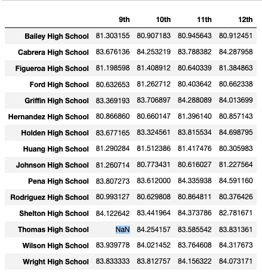

# School_District_Analysis

## Overview 
The school board has identified academic dishonesty in Thomas High School, and they want to uphold state-testing standards. This analysis is going to replace the math and reading scores for Thomas High School with NaNs while keeping the rest of the data intact, to have an updated school distict analysis report. 

What we will have in this analysis are:
1. Updated District Summary
2. Updated School Summary
3. The top 5 performing schools summary
4. The top 5 performing schools summary
5. The average math score for each grade level from each school
6. The average reading score for each grade level from each school
7. Updated Student performance by school spending per student
8. Updated Student performance by school size
9. Updated Student performance by school type

## Results

* Updated District Summary

After excluding the 9th graders' performance in Thomas High School, the overall average math score is 0.1 lowered, thus the percentage of passing math is lowered by 0.2 points. Taverage reaing score is also lowered but since we round the number one decimal place which seems unchange, we can see the change in percentage of passing reading, which is lowered by 0.1 point. And the percentage of passing both math and reading is also lowered by 0.3 point to 64.9. These change shows that the reading and math score of 9th graders in Thomas High School is relatively high in original record compare to others.

* Updated School Summary

Since we just excluded the 9th graders' performance in Thomas High School, only numbers in the row of "Thomas High School" might change, so we only retrieve the image showing Thomas High School Summary. The average math score in Thomas High School is slightly lowered from 83.418349 to 83.350937, dropped 0.08%, thus the percentage of passing math is also dropped from 93.2722% to 93.1857%. However, the reading score is slightly increased from 83.848930 to 83.896082, 0.056% increment. But the precentage of reading dropps from 97.3089% to 97.01874%. Thus, the overall passing percentage dropps 90.948012% to 90.630324%. 

In other words, replacing the ninth graders’ math and reading scores results in a slightly lower average math score, slightly lower math passing rate, slightly lower reading passing rate and slightly lower the overall passing rate.

* The average math score for each grade level from each school

* The average reading score for each grade level from each school

Replacing the ninth-grade scores does not affect Math and reading scores by grade much, just the 9th grade information in Thomas High School is omitted and showed NaN.

* Scores by school spending

Since Thomas High School is in $630-$644 spending range per student, so the Scores by school spending summary is only affected on this range. Replacing the ninth-grade scores in Thomas High School results in a slightly lower average math score, math passing rate, reading passing rate and also overall passing rate in school spending range $630-$644 per student.

* Scores by school size

Since the student count in Thomas High School is 1635, falls in the medium school size, so the Scores by school size summary is only affected on this column. Replacing the ninth-grade scores in Thomas High School results in a slightly lower average math score, math passing rate, reading passing rate and also overall passing rate in medium school catergory.

* Scores by school type

Since the Thomas High School is a Charter school, so the Scores by school type summary is only affected in this catergory. Replacing the ninth-grade scores in Thomas High School results in a slightly lower average math score, math passing rate, reading passing rate and also overall passing rate in Charter school type.

## Summary
All in all, replacing Thomas High School results in a slightly lower average math score, math passing rate, reading passing rate and also overall passing rate. But since the change is not much, only visible to two or more decimal places. If we round the numbers to integer or even one decimal palce, the result might be the same

